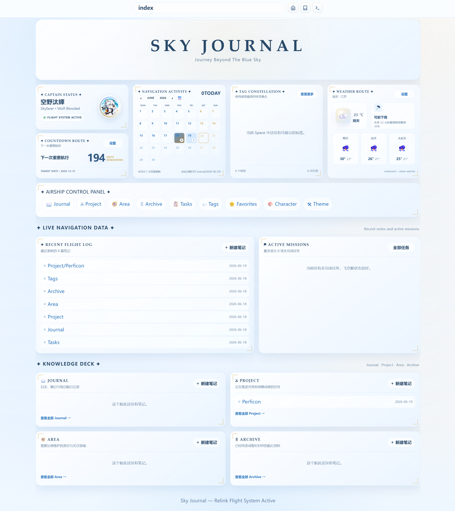
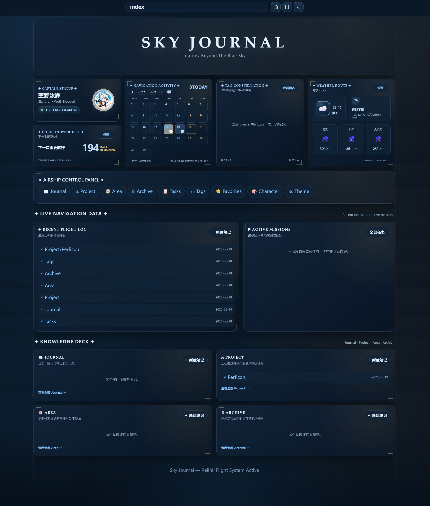
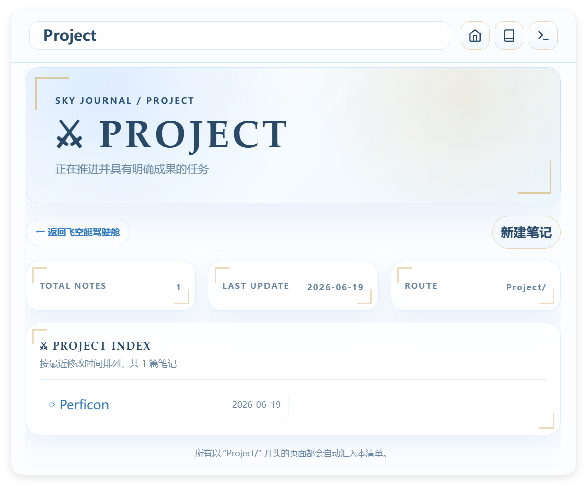
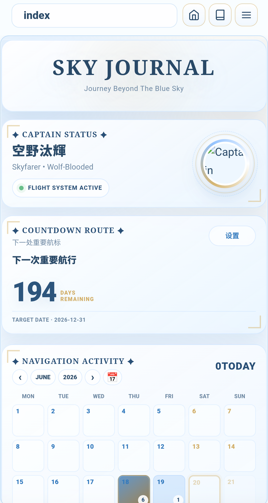

<div align="center">

# ✦ Sky Journal for SilverBullet ✦

### 一套以《碧蓝幻想Relink》飞空艇航行日志为视觉主题的 SilverBullet 主题、Dashboard 与 Widget 系统

```text
          .          ✦          .
     ┌──────────────────────────────┐
     │        SKY JOURNAL SYSTEM    │
     │     RELINK FLIGHT ACTIVE     │
     ├──────────────────────────────┤
     │  THEME   WIDGETS   CONFIG    │
     │  PAGES   MOBILE    PWA       │
     └──────────────────────────────┘
            \      |      /
         ----      ✦      ----
            /      |      \
```


---

## 📖 项目简介

**Sky Journal** 是一套面向 [SilverBullet](https://silverbullet.md/) 的完整视觉与信息组织系统。

它不只是一个 CSS 主题，而是由以下部分共同组成：

- 全局主题与编辑器样式；
- Dashboard 首页；
- Space Lua Widget 组件库；
- Journal / Project / Area / Archive 板块页面；
- Tags 与 Tasks 汇总页面；
- 月度活动日历、倒数日和天气卡片；
- Dashboard 页面保护；
- 移动端标题栏与更多菜单适配；
- PWA、浏览器系统栏与安全区域适配；
- 统一的 `SJConfig` 配置入口。

项目整体采用清爽的蓝、白、金配色，将 SilverBullet Space 组织为一套带有飞空艇仪表盘、航行日志与任务控制中心氛围的个人知识系统。

> [!NOTE]
> 部分 Markdown 元素排版、卡片视觉语言与细节处理参考了 **Phycat**，一个 Typora 主题。  
> Sky Journal 在此基础上针对 SilverBullet 的 CodeMirror 编辑器、DOM 结构、Space Style、Space Lua、Dashboard 和移动端交互进行了重新设计与适配。

---

## 🖼️ 预览

建议在仓库中创建以下目录并替换为实际截图：







---

## ✨ 主要功能

### 🎨 全局主题系统

- 亮色、暗色与系统模式；
- 蓝白金 Sky Journal 配色；
- 系统原生字体栈，无需额外字体文件；
- 标题、段落、列表、任务、表格、链接、引用和代码块统一设计；
- 原生标签在普通、编辑和输入法组合状态下保持一致；
- 代码块选区层级修复；
- Frontmatter 点击折叠与再次展开；
- 目录卡片、Lua Widget 工具栏和编辑器状态统一；
- PWA 与浏览器 `theme-color` 联动；
- iOS 安全区域和系统状态栏适配。

### 🛰️ Dashboard 驾驶舱

- Hero 主视觉；
- Captain HUD 与自定义头像；
- 月度页面活动日历；
- 倒数日卡片；
- 延迟加载天气预报；
- 快捷导航控制面板；
- 动态标签星图；
- 最近笔记；
- Active Missions；
- Journal、Project、Area、Archive 四类 PARA 卡片。

### 🏷️ 标签系统

- 从 Object Index 汇总标签；
- 按引用次数排序；
- Dashboard 标签按内容宽度动态排列；
- 根据卡片剩余高度自动隐藏溢出行；
- Tags 板块页按标签长度动态排列；
- 支持配置排除目录；
- 点击标签进入 SilverBullet 虚拟标签页面。

### 📋 任务系统

- 汇总未完成任务；
- 首页最多显示 8 条；
- Tasks 页面显示完整清单；
- 显示任务来源页面；
- 标签与任务共用排除目录配置；
- 勾选任务并更新索引后自动从列表移除。

### 📱 移动端适配

- 标题栏按钮光学对齐；
- 更多菜单固定在正确位置；
- 菜单点击、关闭和滚动交互修复；
- Page Decoration Prefix 对齐；
- Dashboard、板块页和普通笔记统一响应式布局；
- 移动端卡片、统计区和空状态优化。

---

## 🧱 系统组成

### 核心文件

| 文件 | 作用 |
|---|---|
| `SJTheme.md` | 全局 Space Style、编辑器样式、移动端适配与浏览器控制 |
| `SJ Widgets.md` | Dashboard 卡片、查询、天气、标签、任务与板块页函数 |
| `SJ Dashboard.md` | 定义 `sj.dashboard()`，组合完整首页 |
| `SJConfig.md` | 倒数日、天气、头像、主题模式与目录排除配置 |
| `SJ Page Protection.md` | Dashboard 页面默认预览保护及临时编辑命令 |
| `HideIndexToC.md` | 在 Index 等指定页面隐藏 TOC |

---

## 📦 环境要求

- SilverBullet；
- Space Lua；
- Space Style；
- Object Index；
- 支持现代 CSS 的浏览器；
- 天气功能需要访问 Open-Meteo；
- 建议以 PWA 或现代 Chromium / WebKit / Firefox 浏览器运行。

---

## 🚀 安装

### 1. 导入主题

将 SkyJournal 文件夹下的全部文件与文件夹上传至 SilverBullet的根 space 内。

### 2. 重载系统

执行：

```text
System: Reload
```

必要时再刷新浏览器或重新打开 PWA。

---

## 🙏 致谢

- [SilverBullet](https://silverbullet.md/)：提供可编程、可扩展的 Markdown 知识环境；
- **Phycat**：部分 Markdown 排版、卡片视觉语言与细节样式参考了该 Typora 主题；
- [Open-Meteo](https://open-meteo.com/)：提供天气与地理编码数据；
- Typora 与 Markdown 主题社区：提供了大量排版设计灵感。

> Sky Journal 并非 Phycat 的移植。  
> 本项目针对 SilverBullet 的 CodeMirror、Space Style、Space Lua、Object Index、Dashboard 与 PWA 环境进行了独立适配和扩展。

---

## 📜 版权说明

本项目采用 **CC BY-NC-SA 4.0 国际知识共享许可协议** 开源。

### 你需要遵守以下规则：

1. **署名（BY）**：使用、修改、二次分发本项目时，必须保留原作者署名与本开源协议声明；
2. **禁止商用（NC）**：严禁将本项目、衍生修改版本用于任何商业盈利场景，包括但不限于付费售卖、企业商用部署、付费整合打包、商业产品内置等，商用必须提前获得作者书面授权；
3. **相同方式共享（SA）**：如果你修改后对外分发本项目，衍生作品必须沿用完全相同的 `CC BY-NC-SA 4.0` 协议开源，不允许更换为宽松类商用开源协议。

### 引用说明

本项目部分 Markdown 样式参考开源主题 Phycat，原设计相关版权归其原作者所有。

---

<div align="center">

```text
✦ SKY JOURNAL · RELINK FLIGHT SYSTEM ACTIVE ✦
```

Made for SilverBullet, personal knowledge systems, and journeys beyond the blue sky.
